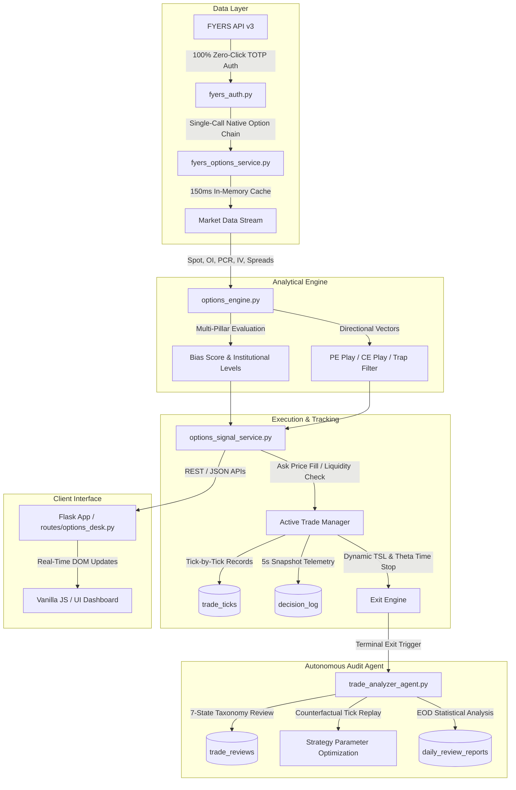
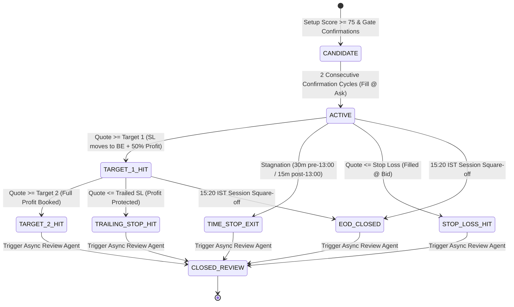

# 🏛️ Options Desk — System Architecture & Technical Specification

This document provides a comprehensive technical breakdown of the Options Desk architecture, including data pipelines, decision engines, active trade lifecycle management, dynamic trailing stop-loss mechanics, autonomous post-trade quality audits, and database persistence.

---

## 📐 High-Level Architecture Diagram



---

## 🧩 Core Subsystems

### 1. Data Ingestion & Broker Authentication (`fyers_auth.py` & `fyers_options_service.py`)
* **Zero-Click TOTP Authentication**: Uses headless TOTP verification via `pyotp` to exchange credentials for a daily access token automatically without user browser interaction.
* **Token Caching**: Caches tokens in `instance/fyers_token.json`, valid for the full Indian trading day.
* **Native High-Speed Option Chain**: Uses FYERS native option chain API endpoint (`/data/options-chain-v3`) delivering sub-150ms latency across benchmark indices (`NIFTY`, `BANKNIFTY`, `FINNIFTY`, `MIDCPNIFTY`, `SENSEX`).

---

### 2. Multi-Pillar Market Bias & Scoring Engine (`options_engine.py`)
Evaluates 6 core institutional market pillars on every refresh cycle:
1. **Directional Spot Trend**: Spot price position relative to intraday EMAs and open.
2. **Key OI Cluster Levels**: Heavy Call writing ($R_1, R_2$) and Put writing ($S_1, S_2$) identification.
3. **Open Interest Velocity**: Real-time Call vs Put OI unwinding / writing acceleration.
4. **Put-Call Ratio (PCR)**: Net PCR and ATM PCR momentum.
5. **Volume Expansion**: Call vs Put volume expansion ratio.
6. **Implied Volatility (IV) Regime**: ATM IV percentile vs historical baseline.

---

### 3. Active Trade Tracking & Trailing SL Engine (`options_signal_service.py`)

#### State Machine & Execution Lifecycle:



#### Trailing Stop-Loss (TSL) Logic:
* **Step 1 (+10% Gain or 50% to T1)**: Stop Loss moves to `Entry + 1.0 pt` (Guaranteed Breakeven).
* **Step 2 (+20% Gain or 80% to T1)**: Stop Loss locks in +10% gain (`Entry × 1.10`).
* **Step 3 (Target 1 Reached)**: Position status transitions to `TARGET_1_HIT`. Stop Loss moves to `Entry + 0.5 × (Target 1 - Entry)`.
* **Step 4 (Beyond Target 1)**: Stop Loss dynamically ratchets: `Target 1 + 0.5 × (Highest - Target 1)`.
* **Exits Filled at Real Bid**: All square-offs and stop executions strictly execute at live **Bid** prices to reflect true market fills.

---

### 4. Autonomous Post-Trade Review & Diagnostic Agent (`trade_analyzer_agent.py`)

Upon terminal trade exit, the review agent analyzes tick history and classifies the trade into one of 7 mutually exclusive diagnostic classifications:

| Classification | Diagnostic Rule | Corrective Feedback |
| :--- | :--- | :--- |
| **`CLEAN_WIN`** | Reached Target 1/Target 2 with minimal drawdown ($\text{MAE} \le 0.5R$). | Reinforces setup criteria. |
| **`WRONG_DIRECTION`** | Immediately failed; never achieved meaningful profit ($\text{MFE} \le 0.05R$). | Evaluates entry filter thresholds. |
| **`RIGHT_THEN_REVERSED`** | Achieved $\ge 0.5R$ or 50% of Target 1, but reversed into a loss. | Evaluates trailing stop responsiveness. |
| **`STOPPED_BY_NOISE`** | Hit Stop Loss, but underlying recovered to Target 1 within 30 minutes. | Identifies tight stop-loss placement. |
| **`THETA_STAGNATION`** | Held $>45\text{ mins}$ without momentum, eroded by option time decay. | Confirms time-stop efficiency. |
| **`EARLY_EXIT`** | Exited at target/time-stop, but underlying ran $\ge 1.5\times$ further. | Suggests runner lot scaling. |
| **`DATA_QUALITY_ISSUE`** | Abnormal bid-ask spread or missing IV quote detected. | Filters exchange anomalies. |

---

### 5. Persistent Storage & Database Schema (`options_signals.db`)

All tables run in **SQLite Write-Ahead Logging (WAL)** mode (`PRAGMA journal_mode=WAL`) with concurrent-safe retry locks:

```text
instance/options_signals.db
├── signals                     # Lifetime trade journal records (Entry, SL, TSL, T1, T2, P&L)
├── trade_ticks                 # High-frequency tick-by-tick records per open trade
├── trade_reviews               # Automated post-trade diagnostic audit reports
├── decision_log                # 5-second evaluation snapshots & forward 15m/30m labels
├── trending_oi_snapshots       # 5-minute interval OI metrics timeseries
├── daily_review_reports        # EOD statistical performance reports
└── scheduler_process_lock      # OS-level & DB exclusive process lock with heartbeat
```

* **Data Preservation Guarantee**: Data is permanently preserved on disk. User deletions use **Soft Deletes** (`is_deleted = 1`), preventing accidental data loss.
